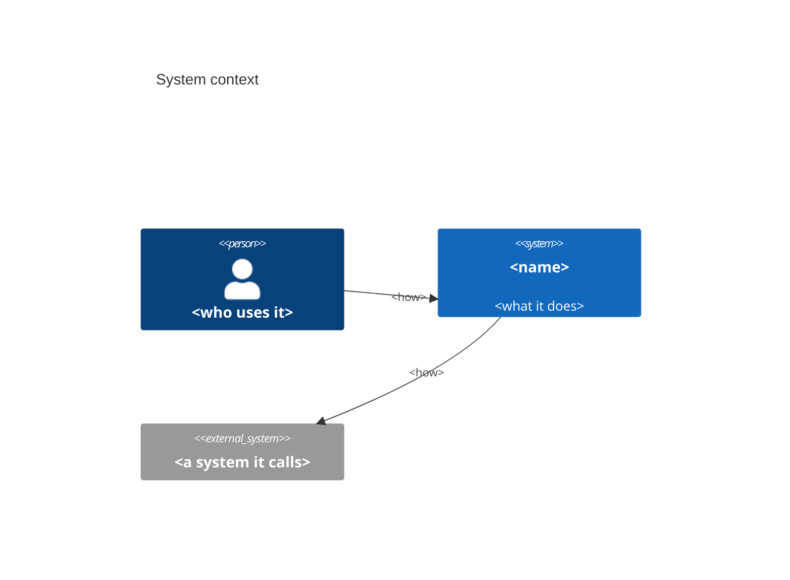
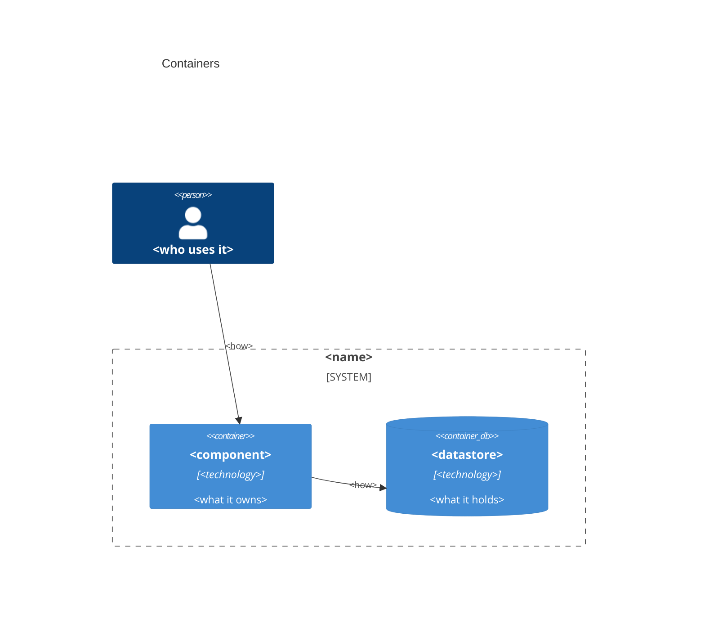

# Architecture

The living overview. A newcomer reads this first. A design that changes the shape updates it in the same PR.

## What it does

<One paragraph. What the system does, for whom.>

## Targets

<The non-functional numbers it is built to: availability SLO, p99 latency SLO, expected load, data loss tolerated and time to recover after a failure, monthly cost. And what happens for the rest of the month when an SLO is missed. The readiness checklist points here.>

## Components

<Each component, what it owns, and what it must not do.>

The diagrams here are [C4](https://c4model.com/), written in Mermaid so GitHub renders them from the text below. Mermaid's [C4 syntax](https://mermaid.js.org/syntax/c4.html) is marked experimental. If GitHub stops rendering a diagram, fix the diagram text in the same PR that notices it.

## Data flow

<How a request or an event moves through the components in the container diagram above. Prose, one path at a time.>

## Boundaries

<Where untrusted input enters, where the system calls something it does not own, where privilege changes. `docs/threat-model.md` has the attacker's view of the same lines.>

## Decisions

<Links to the ADRs that shaped this, newest first.>
